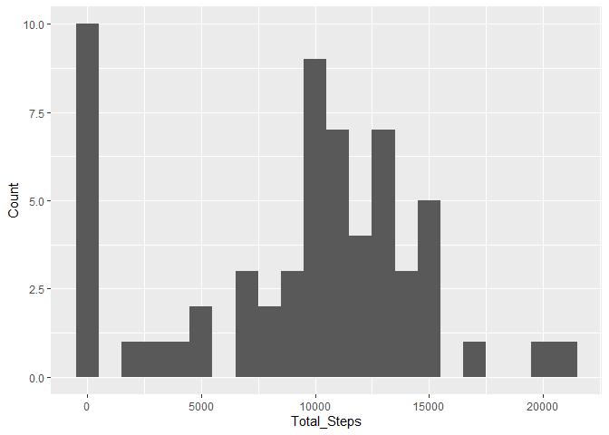
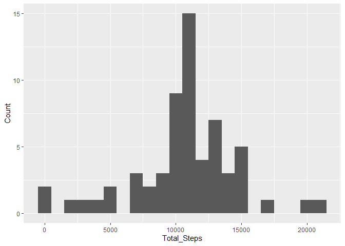
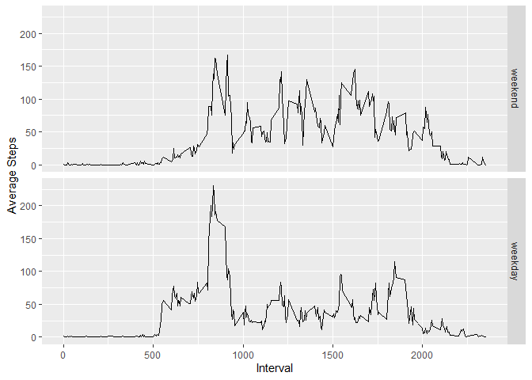

## Loading and preprocessing the data

Firstly, we need to load the dplyr package and read in the data. Then we convert the date variable to type 'Date'

```r
library(dplyr)
data <- read.csv(unz("activity.zip", "activity.csv"))
data$date <- as.Date(data$date)
```

## What is mean total number of steps taken per day?

Let's create a dataframe showing the total steps taken by date

```r
totals <- data %>%
          group_by(date) %>%
          summarise(Total_Steps = sum(steps, na.rm = TRUE))
```

This dataframe looks like this:

```r
head(totals)
```

```
## # A tibble: 6 × 2
##   date       Total_Steps
##   <date>           <int>
## 1 2012-10-01           0
## 2 2012-10-02         126
## 3 2012-10-03       11352
## 4 2012-10-04       12116
## 5 2012-10-05       13294
## 6 2012-10-06       15420
```

Now we make a histogram to show the spread of the daily total step counts

```r
library(ggplot2)
ggplot(totals, aes(x=Total_Steps)) + geom_histogram(binwidth = 1000) + labs(y = "Count")
```

<!-- -->

Now we can calculate the mean and the median of the daily step counts

```r
mean(totals$Total_Steps)
```

```
## [1] 9354.23
```

```r
median(totals$Total_Steps)
```

```
## [1] 10395
```
So the mean total steps taken in a day is around 9354


## What is the average daily activity pattern?

First we can create a datafram showing the average steps by time interval:

```r
interval_totals <- data %>%
                   group_by(interval) %>%
                   summarise(AVG_steps = mean(steps, na.rm = TRUE))
```
This dataframe looks like this:

```r
head(interval_totals)
```

```
## # A tibble: 6 × 2
##   interval AVG_steps
##      <int>     <dbl>
## 1        0    1.72  
## 2        5    0.340 
## 3       10    0.132 
## 4       15    0.151 
## 5       20    0.0755
## 6       25    2.09
```

Now we can plot the average steps by time interval:

```r
plot(interval_totals, type = "l", xlab = "Time Interval", ylab = "Average Steps")
```

<!-- -->

To find the interval with the highest average steps we can use the following code:

```r
interval_totals[which.max(interval_totals$AVG_steps),]
```

```
## # A tibble: 1 × 2
##   interval AVG_steps
##      <int>     <dbl>
## 1      835      206.
```

so we can see that 8:35am contains the highest number of steps, on average across all the days 
in the dataset


## Imputing missing values

First let's take a look at how many NA values occur in the data: 

```r
sum(is.na(data))
```

```
## [1] 2304
```

Now let's see where they occur:

```r
sum(is.na(data$steps))
```

```
## [1] 2304
```
We can see that all of the NA values are in the steps column

Now we can replace these with the average daily steps for the relevant time periods:

```r
#Create a copy of the data
imputed_data <- data.frame(data)
#Get a list of the rows with NA values
nas <- imputed_data[is.na(imputed_data) == TRUE,]
#Loops through each row that has an NA value
for (i in rownames(nas)) {
  #Setting the NA value in the "steps column
  imputed_data[i,"steps"] = 
    #Finds the row in the interval_totals table with the interval from the row we
    #are looking at and replaces the NA value with the average steps value from the
    #row in the interval_totals table
    interval_totals[which(interval_totals$interval == imputed_data[i,"interval"]),
                    "AVG_steps"]
}
```

Let's re-run the histogram, from part 1 with the imputed data:


```r
imp_totals <- imputed_data %>%
              group_by(date) %>%
              summarise(Total_Steps = sum(steps, na.rm = TRUE))
```


```r
ggplot(imp_totals, aes(x=Total_Steps)) + geom_histogram(binwidth = 1000) + labs(y = "Count")
```

<!-- -->


Now we can re-run the mean and median values on the imputed data as well:

```r
mean(imp_totals$Total_Steps)
```

```
## [1] 10766.19
```

```r
median(imp_totals$Total_Steps)
```

```
## [1] 10766.19
```

We can see that the mean value has risen to around 10766 steps a day after imputing the missing values.


## Are there differences in activity patterns between weekdays and weekends?


First we can create a new Factor variable showing the weekdays of each date

```r
imputed_data$Weekday <- factor((weekdays(imputed_data$date) %in% 
                                  c("Monday",
                                    "Tuesday",
                                    "Wednesday",
                                    "Thursday",
                                    "Friday")),
                                #create levels
                                levels=c(FALSE, TRUE),
                                #labelling the levels
                                labels=c('weekend', 'weekday'))

imputed_interval_totals <- imputed_data %>%
                           group_by(interval, Weekday) %>%
                           summarise(AVG_steps = mean(steps))
```

Now we can create a plot to show the differences between the weekday and weekend data:

```r
qplot(interval, AVG_steps, data = imputed_interval_totals, facets = "Weekday", geom = "line", xlab = "Interval", ylab = "Average Steps")
```

<!-- -->

We can see that there is generally a larger amount of steps taken early in the morning on weekdays, whereas there is more of a spread out activity level throughout the day on weekends
